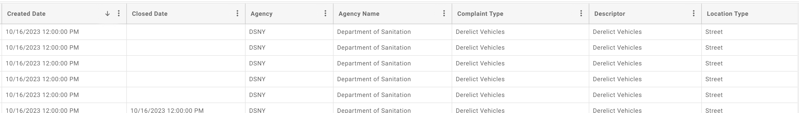
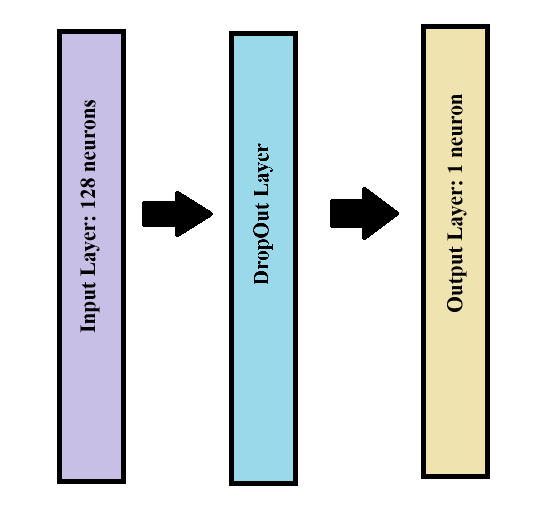
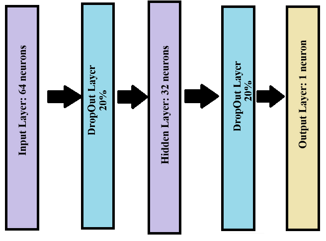
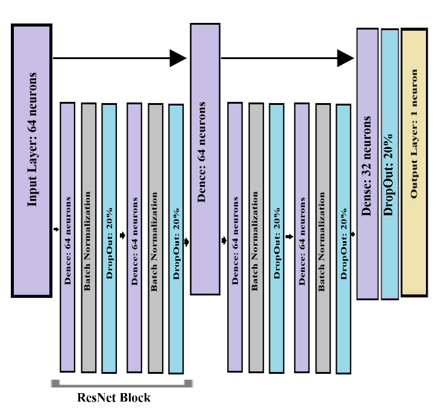

#  311 Service Time Prediction Agencies in New York City 

We aim to test out three different models — a linear regression, a neural network, and a decision tree — to determine if we can predict how long it takes to resolve 311 calls. We anticipate that significant features could be the particular city agency responding, such as the Sanitation Department or the NYPD, the location of the caller, and the problem described by the caller. By analyzing these features, we aim to employ various models to predict the time it takes to resolve these service requests. Linear regression will serve as our baseline model, while decision trees and neural networks will be implemented to explore different modeling techniques. This project's objective is to evaluate and identify the most effective model for predicting the resolution time of service requests within New York City's agencies.

## Data Availability Statement

The dataset used in this project, "311 Service Requests from 2010 to Present," is publicly available through the City of New York's official data portal at the following URL: [Link to Dataset](https://data.cityofnewyork.us/Social-Services/311-Service-Requests-from-2010-to-Present/erm2-nwe9). This dataset provides several variables that could be used as features, including agency, complaint type, descriptor, location type, zip code, and borough. Below, we provide the screenshot of the data set we are using. 

Table 1. A sample from the dataset “311 Service Requests from 2010 to Present”

Some features, such as agency name and agency, exhibit a linear correlation and can easily be dropped. Location is a critical feature, especially amid concerns that city agencies may service wealthier, more privileged neighborhoods faster and more efficiently than others. Another valuable feature could be the distance from the agency's location to the neighborhood of the request — though this would require more investigation and may not be that predictive, depending on whether the agency has field offices. This feature could be calculated using the request's location (x, y coordinates).  Complaint type could also be valuable, as it might be easier to remove a “Derelict Vehicle” than a “Rodent Infestation.” 

## Data Selection and Processing

We take several steps to prepare our data. First, we split this extremely large dataset into a smaller selection, about 500,000 reports, that we can work with. Unfortunately, we found that our computers could not handle larger file sizes and still allow us to effectively experiment with various models. Hypertuning was only possible on a smaller set of reports in a several code file. 
We also use a “Report Created” and a “Report Resolved” time feature in order to create a new “Time Elapsed” or “Hours Taken” feature. Because we have the time of a report’s creation and resolution down to the minute, we decided to calculate “Hours Taken” as a metric. Within the data set we are working with, the average report takes 72 hours to resolve, though it can be resolved within minutes or possibly dozens of days. Notably, the maximum value for hours taken was 1618 hours and the standard deviation was 178 hours — which shows that our our data includes a lot of variation. 
Hours make sense to use since minutes would be too precise and days would not capture the nuance we’re looking for.  
We turned text-based categories, like Descriptors, into numerical-based categories since the descriptions were standardized. While not required for Gradient Boosting Regression, we used a scaler to normalize data used for other models, such as Linear Regression.

### Data Error Discovery

While working through our project, we discovered a curious error in our data. A number of our samples were showing a negative “Hours Taken” metric, which doesn’t make logical sense. We sought to investigate whether this was a trend throughout the data or whether there was a more focused, particular error.  Ultimately, the issue was limited to one particular agency, the Department of Transportation, and one particular issue: Street Light Condition complaint types. These included street light reports with a variety of problems (“Descriptor”), including potholes and exposed lamp post wires. 
More than 2,000 reports in our sample data had this error. Notably, we dropped this data to avoid the issue impacting our larger training, though, in doing so, potentially underrepresented the Department of Transportation in our model training. 

## Gradient Boosted Regression

For this study, we initially started by evaluating a model with the following parameters: minimum samples = 2, N_estimators = 100, and learning rate = 0.1. We initially achieved an MSE of about 16,000 with this (using in-sample data). However, we conducted parameter tuning and achieved the following results. We select 300 for  N_Estimators, .3 for Learning Rate, and 7 for depth, based on the highest R2 scores. This achieves better results for MSE in the full model.

## Neural Networks Models

Three neural networks were trained for the study: a 1-layer neural network (NN), a 2-layer NN, and a Deep ResNet.

### 1-layer NN:
Architecture: Input layer (fully connected, 128 neurons, ReLU activation, L2 regularization) with an input shape of ( , 7) for seven features. DropOut Layer (20%) follows, and the output layer has a single neuron with linear activation.
Training: Adam optimizer, a learning rate of 0.001 for the first 10 epochs, followed by an exponential decay. Batch size is 32, with a validation split of 80%, using Mean Squared Error as the loss function. 

### 2-layer NN:
Architecture: Input layer (fully connected, 64 neurons, ReLU activation, L2 regularization) with input shape ( , 7). DropOut Layer (20%) precedes a hidden layer (fully connected, 32 neurons, ReLU activation, L2 regularization). Another DropOut Layer (20%) is followed by the output layer with a single neuron and linear activation.
Training: Similar to the 1-layer NN, with Adam optimizer, learning rate schedule, batch size of 32, and 80-20 training-validation split.

### Deep ResNet:
Architecture: Input layer (fully connected, 64 neurons, ReLU activation, L2 regularization) with input shape ( , 7). Residual blocks consist of two Dense layers (64 neurons, ReLU activation, L2 regularization) with Batch Normalization and Dropout (20%) layers. A Dense layer (fully connected, 32 neurons, ReLU activation, L2 regularization) and DropOut Layer (20%) precede the output layer (single neuron, linear activation).
Training: Similar to the previous networks, utilizing Adam optimizer, learning rate schedule, batch size of 32, and 80-20 training-validation split with Mean Squared Error as the loss function

## Feature Selection

First, we drop the large majority of our features, since many are related to relatively niche issues and aren’t designed to address most calls (Some are only related to taxis, for instance). We also dropped the EventID feature, which should not influence our model. We drop Zip Code, for example, because we already have a Borough and two other location features available. Ultimately, we settled on including these features: Longitude, Latitude, Borough Descriptor, Complaint Type, and Responding Agency. 

## Model Selection

Baselines. Two versions of linear regression, including a lasso regression, are used as a baseline to evaluate our models. We also use Mean Squared Error to compare errors across different models. This project aims to evaluate and identify the most effective model for predicting the resolution time of service requests within New York City's agencies. 
Final Model Selection and Conclusion: 
The assignment asks us to prioritize the novelty of the approach and results. We believe we’ve introduced a relatively novel approach — and shown that neural networks can at least offer promise and sometimes comparable results to Gradient Boosted Trees, after some parameter tuning, in processing this data. While there has been some data analysis of NYC 311 calls, we may be the first to dig into using these diverse types of AI tools to make these predictions. 
Ultimately, we showed that GBT could outperform linear regression on both in-sample and out-of-sample data. All of our models, except for ResNet, outperformed Linear Regression. 

## Citations
City of New York. 311 Service Requests from 2010 to Present. [Data set]. Data source URL: [Link to Dataset](https://data.cityofnewyork.us/Social-Services/311-Service-Requests-from-2010-to-Present/erm2-nwe9)
